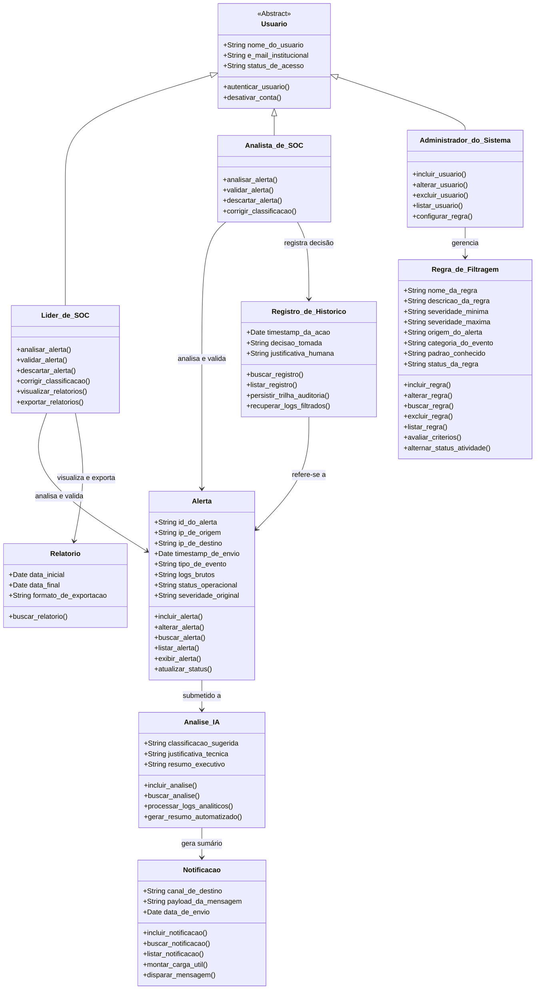

```mermaid
classDiagram
    %% Superclasse de Usuários
    class Usuario {
        <<Abstract>>
        +String nome_do_usuario
        +String e_mail_institucional
        +String status_de_acesso
        +autenticar_usuario()
        +desativar_conta()
    }

    %% Subclasses (Herança)
    class Lider_de_SOC {
        +analisar_alerta()
        +validar_alerta()
        +descartar_alerta()
        +corrigir_classificacao()
        +visualizar_relatorios()
        +exportar_relatorios()
    }

    class Analista_de_SOC {
        +analisar_alerta()
        +validar_alerta()
        +descartar_alerta()
        +corrigir_classificacao()
    }

    class Administrador_do_Sistema {
        +incluir_usuario()
        +alterar_usuario()
        +excluir_usuario()
        +listar_usuario()
        +configurar_regra()
    }

    Usuario <|-- Lider_de_SOC
    Usuario <|-- Analista_de_SOC
    Usuario <|-- Administrador_do_Sistema

    %% Classes de Negócio
    class Regra_de_Filtragem {
        +String nome_da_regra
        +String descricao_da_regra
        +String severidade_minima
        +String severidade_maxima
        +String origem_do_alerta
        +String categoria_do_evento
        +String padrao_conhecido
        +String status_da_regra
        +incluir_regra()
        +alterar_regra()
        +buscar_regra()
        +excluir_regra()
        +listar_regra()
        +avaliar_criterios()
        +alternar_status_atividade()
    }

    class Alerta {
        +String id_do_alerta
        +String ip_de_origem
        +String ip_de_destino
        +Date timestamp_de_envio
        +String tipo_de_evento
        +String logs_brutos
        +String status_operacional
        +String severidade_original
        +incluir_alerta()
        +alterar_alerta()
        +buscar_alerta()
        +listar_alerta()
        +exibir_alerta()
        +atualizar_status()
    }

    class Analise_IA {
        +String classificacao_sugerida
        +String justificativa_tecnica
        +String resumo_executivo
        +incluir_analise()
        +buscar_analise()
        +processar_logs_analiticos()
        +gerar_resumo_automatizado()
    }

    class Notificacao {
        +String canal_de_destino
        +String payload_da_mensagem
        +Date data_de_envio
        +incluir_notificacao()
        +buscar_notificacao()
        +listar_notificacao()
        +montar_carga_util()
        +disparar_mensagem()
    }

    class Registro_de_Historico {
        +Date timestamp_da_acao
        +String decisao_tomada
        +String justificativa_humana
        +buscar_registro()
        +listar_registro()
        +persistir_trilha_auditoria()
        +recuperar_logs_filtrados()
    }

    class Relatorio {
        +Date data_inicial
        +Date data_final
        +String formato_de_exportacao
        +buscar_relatorio()
    }

    %% Relacionamentos do Sistema SATA
    Administrador_do_Sistema --> Regra_de_Filtragem : gerencia
    Lider_de_SOC --> Alerta : analisa e valida
    Analista_de_SOC --> Alerta : analisa e valida
    Alerta --> Analise_IA : submetido a
    Analise_IA --> Notificacao : gera sumário
    Lider_de_SOC --> Relatorio : visualiza e exporta
    Analista_de_SOC --> Registro_de_Historico : registra decisão
    Registro_de_Historico --> Alerta : refere-se a
```
