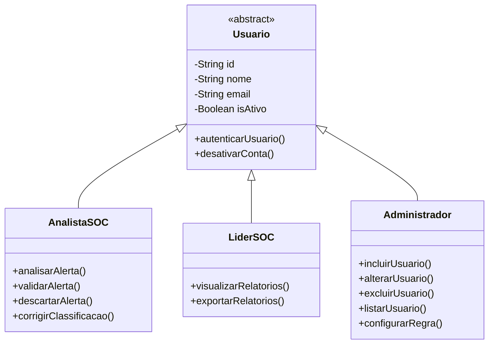

```mermaid
classDiagram
    class Usuario {
        <<abstract>>
        -String id
        -String nome
        -String email
        -Boolean isAtivo
        +autenticarUsuario()
        +desativarConta()
    }

    class AnalistaSOC {
        +analisarAlerta()
        +validarAlerta()
        +descartarAlerta()
        +corrigirClassificacao()
    }

    class LiderSOC {
        +visualizarRelatorios()
        +exportarRelatorios()
    }

    class Administrador {
        +incluirUsuario()
        +alterarUsuario()
        +excluirUsuario()
        +listarUsuario()
        +configurarRegra()
    }

    %% Relacionamento de Herança
    Usuario <|-- AnalistaSOC
    Usuario <|-- LiderSOC
    Usuario <|-- Administrador
```