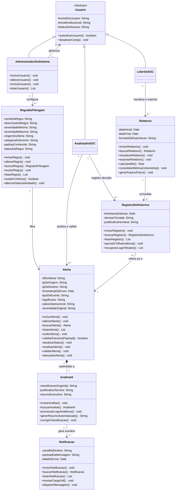

```mermaid
classDiagram
    %% ============================================================
    %% Superclasse abstrata de Usuários
    %% Atributos protegidos (#) para serem herdados pelas subclasses
    %% ============================================================
    class Usuario {
        <<Abstract>>
        #nomeDoUsuario: String
        #emailInstitucional: String
        #statusDeAcesso: String
        +autenticarUsuario() boolean
        +desativarConta() void
    }

    %% ============================================================
    %% Subclasses (Herança / Generalização)
    %% Analista e Líder não têm métodos próprios: as operações foram
    %% realocadas para as classes DONAS dos dados (Especialista na Informação).
    %% Eles participam do sistema por meio das ASSOCIAÇÕES.
    %% ============================================================
    class AnalistaDeSOC {
    }

    class LiderDeSOC {
    }

    %% Administrador MANTÉM o gerenciamento de usuários: é uma ação
    %% restrita por autorização e não pode subir para a superclasse
    %% Usuario (seria herdada por todos os perfis).
    class AdministradorDoSistema {
        +incluirUsuario() void
        +alterarUsuario() void
        +excluirUsuario() void
        +listarUsuario() List
    }

    Usuario <|-- AnalistaDeSOC
    Usuario <|-- LiderDeSOC
    Usuario <|-- AdministradorDoSistema

    %% ============================================================
    %% Classes de Negócio
    %% ============================================================
    class RegraDeFiltragem {
        -nomeDaRegra: String
        -descricaoDaRegra: String
        -severidadeMinima: String
        -severidadeMaxima: String
        -origemDoAlerta: String
        -categoriaDoEvento: String
        -padraoConhecido: String
        -statusDaRegra: String
        +incluirRegra() void
        +alterarRegra() void
        +buscarRegra() RegraDeFiltragem
        +excluirRegra() void
        +listarRegra() List
        +avaliarCriterios() boolean
        +alternarStatusAtividade() void
    }

    class Alerta {
        -idDoAlerta: String
        -ipDeOrigem: String
        -ipDeDestino: String
        -timestampDeEnvio: Date
        -tipoDeEvento: String
        -logsBrutos: String
        -statusOperacional: String
        -severidadeOriginal: String
        +incluirAlerta() void
        +alterarAlerta() void
        +buscarAlerta() Alerta
        +listarAlerta() List
        +exibirAlerta() void
        +validarEstruturaPayload() boolean
        +atualizarStatus() void
        +analisarAlerta() void
        +validarAlerta() void
        +descartarAlerta() void
    }

    class AnaliseIA {
        -classificacaoSugerida: String
        -justificativaTecnica: String
        -resumoExecutivo: String
        +incluirAnalise() void
        +buscarAnalise() AnaliseIA
        +processarLogsAnaliticos() void
        +gerarResumoAutomatizado() String
        +corrigirClassificacao() void
    }

    class Notificacao {
        -canalDeDestino: String
        -payloadDaMensagem: String
        -dataDeEnvio: Date
        +incluirNotificacao() void
        +buscarNotificacao() Notificacao
        +listarNotificacao() List
        +montarCargaUtil() void
        +dispararMensagem() void
    }

    class RegistroDeHistorico {
        -timestampDaAcao: Date
        -decisaoTomada: String
        -justificativaHumana: String
        +incluirRegistro() void
        +buscarRegistro() RegistroDeHistorico
        +listarRegistro() List
        +persistirTrilhaAuditoria() void
        +recuperarLogsFiltrados() List
    }

    class Relatorio {
        -dataInicial: Date
        -dataFinal: Date
        -formatoDeExportacao: String
        +incluirRelatorio() void
        +buscarRelatorio() Relatorio
        +visualizarRelatorio() void
        +exportarRelatorio() void
        +calcularMttr() float
        +consolidarMetricasVolumetria() void
        +gerarArquivoFisico() void
    }

    %% ============================================================
    %% Relacionamentos (associação, composição e multiplicidade)
    %% ============================================================
    AdministradorDoSistema "1" --> "0..*" Usuario : gerencia
    AdministradorDoSistema "1" --> "0..*" RegraDeFiltragem : configura
    RegraDeFiltragem "1" --> "0..*" Alerta : filtra
    AnalistaDeSOC "1" --> "0..*" Alerta : analisa e valida
    Alerta "1" *-- "1" AnaliseIA : submetido a
    AnaliseIA "1" --> "1..*" Notificacao : gera sumário
    AnalistaDeSOC "1" --> "0..*" RegistroDeHistorico : registra decisão
    RegistroDeHistorico "0..*" --> "1" Alerta : refere-se a
    LiderDeSOC "1" --> "0..*" Relatorio : visualiza e exporta
    Relatorio "1" --> "0..*" RegistroDeHistorico : consolida
```
